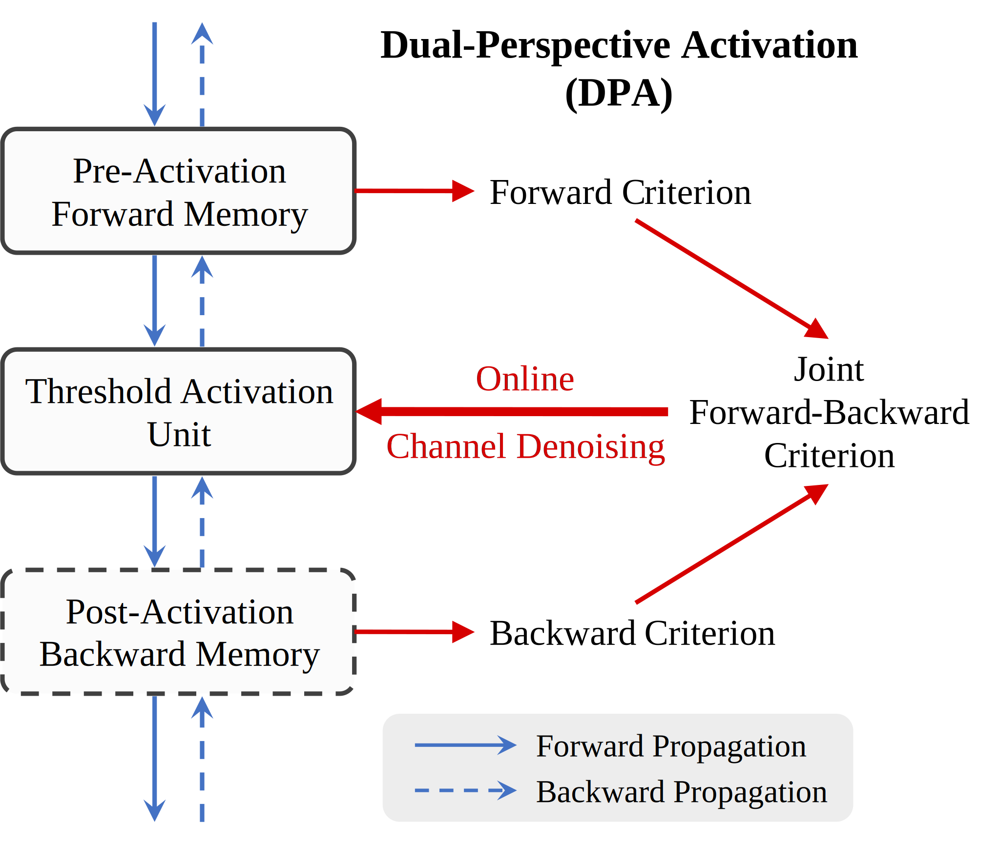

Dual-Perspective Activation: Efficient Channel Denoising via Joint Forward-Backward Criterion for Artificial Neural Networks
========

[](https://neurips.cc/Conferences/2024)
&emsp;[](https://github.com/horrible-dong/QTClassification)
&emsp;[](README.md)
&emsp;[](LICENSE)

> Authors: Tian Qiu, Chenchao Gao, Zunlei Feng, Jie Lei, Bingde Hu, Xingen Wang, Yi Gao, Mingli Song  
> Affiliation: Zhejiang University  
> Links: [[Paper]](https://openreview.net/pdf?id=Ku35qKpveg) | [[Poster]](poster.pdf)

## Abstract

The design of Artificial Neural Network (ANN) is inspired by the working patterns of the human brain. Connections in
biological neural networks are sparse, as they only exist between few neurons. Meanwhile, the sparse representation in
ANNs has been shown to possess significant advantages. Activation responses of ANNs are typically expected to promote
sparse representations, where key signals get activated while irrelevant/redundant signals are suppressed. It can be
observed that samples of each category are only correlated with sparse and specific channels in ANNs. However, existing
activation mechanisms often struggle to suppress signals from other irrelevant channels entirely, and these signals have
been verified to be detrimental to the network's final decision. To address the issue of channel noise interference in
ANNs, a novel end-to-end trainable Dual-Perspective Activation (DPA) mechanism is proposed. DPA efficiently identifies
irrelevant channels and applies channel denoising under the guidance of a joint criterion established online from both
forward and backward propagation perspectives while preserving activation responses from relevant channels. Extensive
experiments demonstrate that DPA successfully denoises channels and facilitates sparser neural representations.
Moreover, DPA is parameter-free, fast, applicable to many mainstream ANN architectures, and achieves remarkable
performance compared to other existing activation counterparts across multiple tasks and domains.

<div align="center">
  
</div>

## Installation

The development environment of this project is `python 3.7 & pytorch 1.11.0+cu113`.

1. Create your conda environment.

```bash
conda create -n qtcls python==3.7 -y
```

2. Enter your conda environment.

```bash
conda activate qtcls
```

3. Install PyTorch.

```bash
pip install torch==1.11.0+cu113 torchvision==0.12.0+cu113 --extra-index-url https://download.pytorch.org/whl/cu113
```

Or you can refer to [PyTorch](https://pytorch.org/get-started/previous-versions/) to install newer or older versions.
Please note that if pytorch ≥ 1.13, then python ≥ 3.8 is required.

4. Install necessary dependencies.

```bash
pip install -r requirements.txt
```

## Training

Import the config file (.py) from [configs](configs).

**single-gpu**

```bash
python main.py --config /path/to/config.py
```

or

```bash
python main.py -c /path/to/config.py
```

**multi-gpu**

```bash
torchrun --nproc_per_node=$num_gpus main.py --config /path/to/config.py
```

or

```bash
torchrun --nproc_per_node=$num_gpus main.py -c /path/to/config.py
```

Currently, the `cifar10` and `cifar100` datasets will be automatically downloaded to the `--data_root` directory. Please
keep the network accessible. For other datasets, please refer to ["How to put your datasets"](data/README.md).

During training, the config file, checkpoints (.pth), logs, and other outputs will be stored in `--output_dir`.

## Evaluation

**single-gpu**

```bash
python main.py --config /path/to/config.py --resume /path/to/checkpoint.pth --eval
```

or

```bash
python main.py -c /path/to/config.py -r /path/to/checkpoint.pth --eval
```

**multi-gpu**

```bash
torchrun --nproc_per_node=$num_gpus main.py --config /path/to/config.py --resume /path/to/checkpoint.pth --eval
```

or

```bash
torchrun --nproc_per_node=$num_gpus main.py -c /path/to/config.py -r /path/to/checkpoint.pth --eval
```

## License

Our code is released under the Apache 2.0 license. Please see the [LICENSE](LICENSE) file for more information.

Copyright (c) QIU Tian and ZJU-VIPA Lab. All rights reserved.

Licensed under the Apache License, Version 2.0 (the "License"); you may not use these files except in compliance with
the License. You may obtain a copy of the License at http://www.apache.org/licenses/LICENSE-2.0.

Unless required by applicable law or agreed to in writing, software distributed under the License is distributed on an
"AS IS" BASIS, WITHOUT WARRANTIES OR CONDITIONS OF ANY KIND, either express or implied. See the License for the specific
language governing permissions and limitations under the License.

## Citation

If you find the paper useful in your research, please consider citing:

```bibtex
@inproceedings{dpa,
  title={Dual-Perspective Activation: Efficient Channel Denoising via Joint Forward-Backward Criterion for Artificial Neural Networks},
  author={Qiu, Tian and Gao, Chenchao and Feng, Zunlei and Lei, Jie and Hu, Bingde and Wang, Xingen and Gao, Yi and Song, Mingli},
  booktitle={Advances in Neural Information Processing Systems},
  year={2024}
}
```
